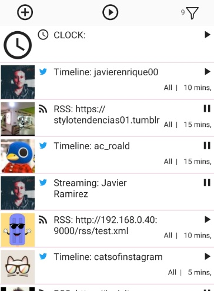
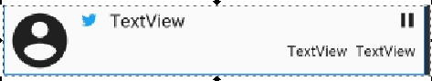

# RecyclerView
Modelo para el funcionamiento del RecyclerView en Kotlin de Android

Con este documento se pretende explicar como aplicar un recyclerView usando el lenguaje de programación Kotlin en Android

### Que es el recyclerView ?

El RecyclerView es una vista especial la cual muestra el contenida de una lista de elementos, y se llama recycler como reciclaje porque la lista donde se muestran los elementos se reusan para no cargar mucha memoria de elementos gráficos asociados a cada elemento de la lista a mostrar.

Toda lista tiene que ser definida a partir de una clase y en Kotlin la manera mas directa es con una clase data Class por ejemplo así:

        data class Data(
            val id : Int,
            val name: String,
            ...
        )

Hay varios archivos involucrados que se deben definir para configurar un recyclerView a continuación vamos a mostrar cuales se requieren:

#### MainFragment.kt

Es el encargado de mostrar el fragmento actual de la aplicación, en este se define el adapter al recyclerView. Aquí la llamamos "adapter"

En la función setUpRecycler() asociamos muchos de los comportamientos que queremos por ejemplo el Recycler divider, el cual es simplemente una linea de color. Está se define en el archivo vertical_divider.xml

También asociamos el itemTouchHelper, el cual nos permitirá detectar cuando el usuario mueve un item para reorganizar la lista.
Nuestro adapter también nos va a generar eventos que vamos a manejar con un Observer que invoca handleEvent(it), también se define el tipo de layoutManager y se asigna al recyclerView en la linea " listRecycler.layoutManager = LinearLayoutManager(context) " y a continuación se asigna el adapter.

Desde el viewModel vamos a cargar la lista con los datos, los cuales probablemente se deban sacar desde la fuente datos,por ejemplo "room". Así mismo estos datos actuales que tiene la lista los vamos a poner en el viewModel en la propiedad actualList. Con esta propiedad no permitirá mover los items con el touch y que se asignen con sus cambios a la base de datos.

Los eventos generados por el adapter se van a manejar en handleEvent() donde podemos asignar el "startDrag" y "onMoveItem"

        class MainFragment : Fragment {

        private lateinit var adapter: RecyclerAdapter

            override fun onCreateView(...){
            ....
            return view

            override fun onActivityCreated(...){
                ...
                viewModel = ... (definicion del viewModel)
                ...          
                setUpRecycler()
            }

            private fun setUpRecycler(){

                //--- setup recycler divider
                val itemDecoration = DividerItemDecoration(context, DividerItemDecoration.VERTICAL)
                val draw = context!!.getDrawable(R.drawable.vertical_divider)
                itemDecoration.setDrawable(draw!!)
                listRecycler.addItemDecoration(itemDecoration)

                itemTouchHelper.attachToRecyclerView(listRecycler)
                adapter = TwitterSearchAdapater(context!!,viewModel.cacheImages)

                //--- maneja eventos generados por el recyclerviewAdapter
                adapter.event.observe(viewLifecycleOwner, Observer {   handleEvent(it)  })

                listRecycler.layoutManager = LinearLayoutManager(context)
                listRecycler.adapter = adapter

                //---inicializa el observador de la lista
                viewModel.list.observe(viewLifecycleOwner, Observer {

                        //--- de la base de datos debe transformar los datos a que queden
                        viewModel.actualList = cleanList(it)

                        adapter.submitList(viewModel.actualList)
                        adapter.notifyDataSetChanged()
                })

            }

            ...

            fun handleEvent(event: listEvent){
                when(event){
                    is Event.OnItemClick ->{
                            viewModel...
                        }
                        ...
                        is Event.OnStartDrag -> itemTouchHelper.startDrag(event.viewHolder)
                        is Event.OnMoveItem -> viewModel.moveItems(event.from,event.to,adapter)
                }

        }

### vertical_divider.xml

Este archivo nos asigna el divider y define una forma (shape) la cual básicamente tiene una altura y un color que podremos personalizar 

        <?xml version="1.0" encoding="utf-8"?>
        <shape xmlns:android="http://schemas.android.com/apk/res/android" >
            <size android:height="2dip" />
            <solid android:color="@color/midlePurple" />
        </shape>

### main_fragment.xml

Este es el archivo del layout del fragmento donde va a estar alojada nuestro vista recyclerView. Nuestra recyclerView la vamos a llamr "listRecycler" y podemos ponerla donde queramos de acuerdo a nuestro layout, que en este caso es un cosntrainLayout

        <?xml version="1.0" encoding="utf-8"?>
        <androidx.constraintlayout.widget.ConstraintLayout xmlns:android="http://schemas.android.com/apk/res/android"
        ....>

                <TextView
                android:id="@+id/cuentaItem"
                android:layout_width="wrap_content"
                android:layout_height="wrap_content"
                android:layout_marginTop="16dp"
                android:layout_marginEnd="2dp"
                app:layout_constraintEnd_toStartOf="@+id/filtroBtn"
                app:layout_constraintTop_toTopOf="parent" />

        <androidx.recyclerview.widget.RecyclerView
                android:id="@+id/listRecycler"
                android:layout_width="match_parent"
                android:layout_height="0dp"
                android:layout_marginTop="8dp"
                app:layout_constraintBottom_toTopOf="@+id/scene_root"
                app:layout_constraintEnd_toEndOf="parent"
                app:layout_constraintHorizontal_bias="0.0"
                app:layout_constraintStart_toStartOf="parent"
                app:layout_constraintTop_toBottomOf="@+id/addFeed" />

### viewModel.kt

En este archivo vamos a tener el modelo que le vamos a asignar a nuestro fragmento, el cual también podría ser el de nuestra actividad si lo necesitamos.

Aquí básicamente vamos a tener nuestra fuente de datos llamada "list" y nuestrps datos cargados al adapter llamada "actualList". Además vamos a poner nuestras funciones para implementar el "moveItems", la cual va a actualizar la fuente de datos de ROOM y reordenar los items del "actualList"

        class MainViewModel(private val app:Application) : ViewModel() {
        ...
            val list : MutableLiveData<List<Data>> by lazy { MutableLiveData<List<Data>>()}
            lateinit var actuaList : MutableList<Data>

            fun moveItems(from:Int,to:Int,adapter:Adapter){
                val toData = actualList[to]
                val toOrderId = toData.orderId
                val removeData = actualList.removeAt(from)
                val fromOrderId = removeData.orderId
                removeData.orderId = toOrderId
                toData.orderId = fromOrderId
                actualList.add(to,removeData)
                viewModelScope.launch(Dispatchers.IO) {
                    dataDao.update(removeData)
                    dataDao.update(toData)
                }
            }
            ...
        }

### RecyclerAdapter.kt

Este es nuestro adaptador de los datos y nos permitirá asociar y definir adecuadamente el viewHolder, el cual es una clase definida dentro de nuestro adapter que contendrá la equivalencia entre el layout del item del elemento de la lista a mostrar llamdo "recycler_item" y nuestro adaptador.

Así mismo tendremos que sociar en "onCreateViewHolder" el evento del inicio del drag asignado al onTouchListener del elemento que definiremos que sea nuestro drag,

En "onBindViewHolder" obtendremos todos los elemntos que haya que mostrar, estos nos podrán generar eventos de click y así mismo asignaremos los datos que proviene del adapter al holder.

Al final tenemos nuestro viewHolder donde tendremos que asociar todos nuestros elementos gráficos del "recycler_item.xml"

        class Adater(val context:Context, val cacheImages: CacheImages,
            val event:MutableLiveData<Event> = MutableLiveData()) : ListAdapter<Data,
            Adapater.ViewHolder>(DiffUtilCallback()) {

            override fun onCreateViewHolder(parent: ViewGroup, viewType: Int): ViewHolder {
                val inflater = LayoutInflater.from(parent.context)
                val viewHolder = ViewHolder(inflater.inflate(R.layout.recycler_item, parent, false))
                //-- detectar el touch sobre el icono para iniciar el
                viewHolder.itemView.imagePeople.setOnTouchListener { view, motionEvent ->
                    if(motionEvent.actionMasked == MotionEvent.ACTION_DOWN){
                        event.value = Event.OnStartDrag(viewHolder)
                    }
                    return@setOnTouchListener true
                }
                return viewHolder
            }

            override fun onBindViewHolder(holder: TwitterSearchViewHolder, position: Int) {
                getItem(position).let {
                    item ->

                holder.typeIcon.setImageResource(....item.xxx)

                ...
                    //-- Selection control
                    holder.layout.setOnClickListener {
                        event.value = Event.OnItemClick(position,item)
                    }

            }

            fun moveItem(from:Int,to:Int){
                event.value = Event.OnMoveItem(from,to)
            }

            class ViewHolder(root: view) : RecyclerView,ViewHolder(root){
            var typeIcon: ImageView = root.typeIcon
            var layout : Contrainlayout = root.constrainLayout1
            var imagePeople : ImageView = root.imagePeople
            ...
            }

        }

### recycler_item.xml

Este es un layout que organiza los elementos gráficos que se cargarán en el recyclerView.

Deberás poner todos los elemtos gráficos que te interese mostrar como textViews, ImageViews, etc estos los asociaras en el viewHolder por su nombre

        <?xml version="1.0" encoding="utf-8"?>
        <androidx.constraintlayout.widget.ConstraintLayout xmlns:android="http://schemas.android.com/apk/res/android"
        ....
        <ImageView.../>
        <TextView.../>
        ...

### DiffUtilCallback.kt

Esta clase define cuales campos del Data adapter, serán considerados para detectar que un elemento ha cambiado o como un item es considerado el mismo.

Esto se calcula cada vez se invoca un adapter.notifyDataSetChanged(). En nuestro caso definimos que los items son los mismos si tienen el id igual, ya que estos provienen de una base de datos con un id autodefinido por la base de datos.

También definimos que los items tienen un contenido nuevo, y por tanto habrá que refrescarlos cuando el campo String "search", el campo select.. etc sean diferentes entre el new y el old.

        class DiffUtilCallback : DiffUtil.ItemCallback<Data>() {

            override fun areContentsTheSame(oldItem: Data, newItem: Data): Boolean {
                return (oldItem.search.contentEquals(newItem.search) and (oldItem.select==newItem.select) and (oldItem.enable==newItem.enable) and (oldItem.orderId==newItem.orderId) and (oldItem.imgLoaded==newItem.imgLoaded))
            }

            override fun areItemsTheSame(oldItem: Data, newItem: Data): Boolean {
                return (oldItem.id == newItem.id)
            }
        }

### Event.kt

Creamos una clase Event.kt la cual nos definirá cuales eventos generados en el adapter tendremos que manejar en nuestro fragmento.

Es denotar que en nuestro ejemplo estamos generando un evento OnImgToUpdate, la cual indica que no tenemos una imagen lista del item que hay que cargar, este evento lo cargaremos a una cola de un Flow de Kotlin, que no mostraremos ahora, pero se podrá generar facilmente de acuerdo a lo visto en la siguiente documentación: [callbackflow](https://github.com/Javierenrique00/callbackflow) y una vez esté cargado de la WEB o de la baseDeDatos o almacenamiento interno y está en RAM nos generará un cambio de la lista de que un item Ha cambiado invocándolo con un XXXX

También observamos los eventos OnStartDrag y OnMoveItem los cuales se dispararán en itemToucherHelper.kt

        sealed class Event {
            data class OnItemClick(val position:Int,val item: Data) : Event()
            data class OnItemLongClick(val position:Int,val item: Data) : Event()
            data class OnImgToUpdate(val position:Int, val item: Data, val cacheImages: CacheImages) : Event()
            data class OnStartDrag(val viewHolder: RecyclerView.ViewHolder) : Event()
            data class OnMoveItem(val from:Int, val to:Int) : Event()
        }

### itemTouchHelper.kt

Aquí definimos el TouchCallBack asociada al adapter y es la clase que nos permite mover y reordenar items, para mas información de esta clase la podrás ver en: [Drag and reorder RecyclerView items in a user friendly manner](https://medium.com/@yfujiki/drag-and-reorder-recyclerview-items-in-a-user-friendly-manner-1282335141e9)

        val itemTouchHelper by lazy {
            // 1. Note that I am specifying all 4 directions.
            //    Specifying START and END also allows
            //    more organic dragging than just specifying UP and DOWN.
            val simpleItemTouchCallback =
                object : ItemTouchHelper.SimpleCallback(UP or
                        DOWN or
                        START or
                        END, 0) {

                    override fun onMove(recyclerView: RecyclerView,
                                        viewHolder: RecyclerView.ViewHolder,
                                        target: RecyclerView.ViewHolder): Boolean {

                        val adapter = recyclerView.adapter as Adapater
                        val from = viewHolder.adapterPosition
                        val to = target.adapterPosition
                        // 2. Update the backing model. Custom implementation in
                        //    MainRecyclerViewAdapter. You need to implement
                        //    reordering of the backing model inside the method.
                        adapter.moveItem(from, to)
                        // 3. Tell adapter to render the model update.
                        adapter.notifyItemMoved(from, to)

                        return true
                    }
                    override fun onSwiped(viewHolder: RecyclerView.ViewHolder,
                                        direction: Int) {
                        // 4. Code block for horizontal swipe.
                        //    ItemTouchHelper handles horizontal swipe as well, but
                        //    it is not relevant with reordering. Ignoring here.
                    }

                    //--- para detectar que se seleccion
                    override fun onSelectedChanged(
                        viewHolder: RecyclerView.ViewHolder?,
                        actionState: Int
                    ) {
                        super.onSelectedChanged(viewHolder, actionState)

                        if(actionState == ACTION_STATE_DRAG){
                            viewHolder?.itemView?.alpha = 0.5f
                        }

                    }

                    override fun clearView(
                        recyclerView: RecyclerView,
                        viewHolder: RecyclerView.ViewHolder
                    ) {
                        super.clearView(recyclerView, viewHolder)

                        viewHolder.itemView.alpha = 1.0f
                    }
                }

            ItemTouchHelper(simpleItemTouchCallback)
        }

